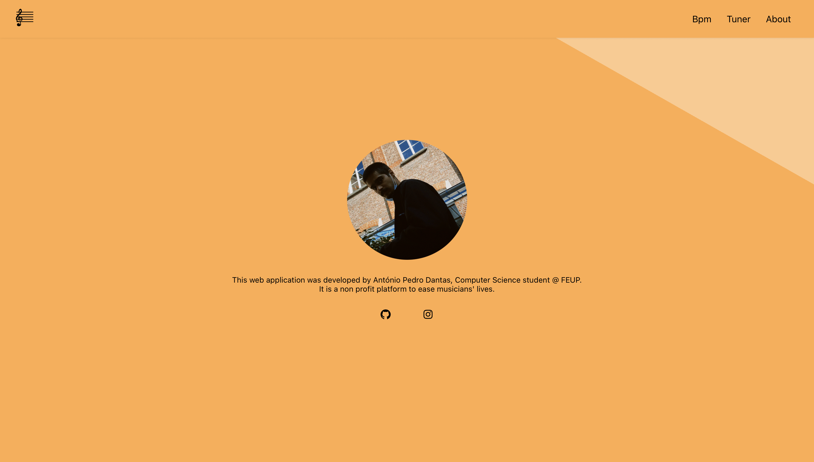

# Musician Buddy

The idea for this project came up when I struggled to find a way to tell in which BPMs I'm in when tapping in a beat. Soon I discovered that I could make those calculations with maths and the help of programming. I decided to put this into a web application since it is easier to access and to have a better UX/UI experience. The project is ever changing and now has also the possibility to play a note in order for you to tune your instruments accordingly. I called it Musician Buddy.




## Run it

* Install node.

* ```yarn install``` and ```yarn start``` on the root folder.
